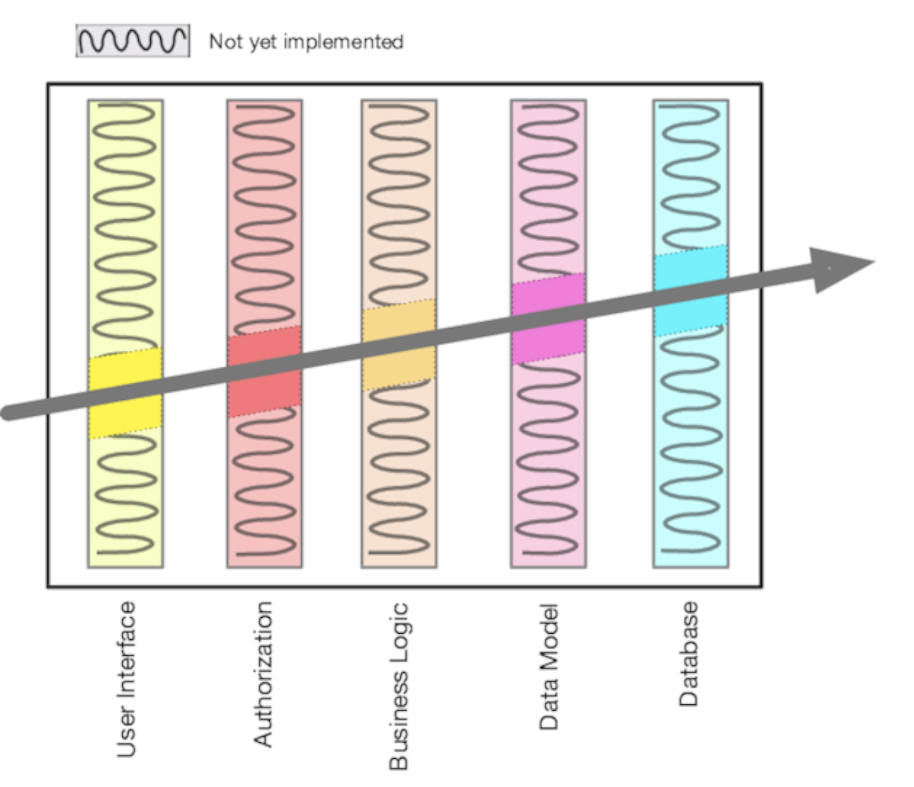

# 示踪子弹
<!-- 2020.03.10 -->

> 准备，开火，瞄准...
> --- 匿名

我们在开发软件时经常谈论如何达到目标。我们实际上并没有在射击场发射任何东西，但它仍然是一个有用的和非常直观的比喻。特别值得一提的是，在一个复杂多变的世界里，考虑如何击中目标是很有意思的。

当然，答案取决于你瞄准设备的性质。对很多人来说，你只有一次瞄准的机会，然后看看你是否击中了靶心。但还有更好的办法。
您知道人们正在使用机枪射击的所有电影，电视节目和视频游戏吗？ 在这些场景中，您经常会看到子弹的路径像是空中明亮的条纹。 这些条纹来自示踪子弹。

追踪器子弹与常规弹药间隔装载。当它们被发射时，它们的磷会被点燃，并留下从枪到它们击中的任何东西的烟火痕迹。如果追踪器击中目标，那么普通子弹也是。士兵们使用这些追踪弹来改进他们的目标：在实际情况下，这是实用的、实时的反馈。

同样的原则适用于项目，尤其是当您构建以前未构建的项目时。 我们使用 示踪子弹开发 这一术语来直观地说明在目标不断变化的实际条件下即时反馈的需求。

像枪手一样，您试图在黑暗中击中目标。 因为您的用户以前从未见过这样的系统，所以他们的要求可能很含糊。 由于您可能正在使用不熟悉的算法，技术，语言或库，因此您会遇到许多未知数。 而且由于项目需要花费时间才能完成，因此您可以保证在工作之前，您正在工作的环境将发生变化。

经典的应对方法是指定死亡制度。 产生大量的纸张，逐项列出每一项要求，将所有未知的事项都捆绑在一起，并限制环境。

使用航位推测法开火。 预先进行一次重大计算，然后射击并充满希望。

但是，实用程序员倾向于使用等同于示踪子弹的软件。

---

## 针对 Beta 读者的问题
我们认为示踪子弹的隐喻可以唯一地体现我们试图传达的信息：将反馈机制注入作品的实际背景。

但是，我们也意识到我们生活在敏感时期，在某些时代，某些主题被视为禁止进入，因为它们可能会引发困扰。在发生大量枪击事件后，我们想知道是否谈论枪支和子弹是否与这一点相抵触。

我们强烈希望它不会。世界充满了好事和坏事。我们不能简单地不提坏事，而把它们消除掉；对他们感到不安是一种务实的反应，并且需要采取行动。

那么，有什么问题吗？我们可以把它留在里面吗？如果没有，是否还有一个比喻能够像这个想法一样抓住这个想法？
请让我们知道：跳至 https://forms.gle/kfDvm5JSFhUozqXb9 进行的简短调查，并回答一个半问题。

---

## 黑暗中发光的代码

追踪子弹之所以起作用，是因为它们在与真实子弹相同的环境中和相同的约束下运行。 他们迅速到达目标，因此炮手会立即获得反馈。 从实际的角度来看，它们是一个相对便宜的解决方案。

为了在代码中获得相同的效果，我们正在寻找能够使我们从需求到最终系统的某些方面快速，可视和可重复的东西。

寻找重要的需求，即定义系统的需求。 寻找您有疑问和最大风险的领域。 然后确定您的开发优先级，以便这些是您编写的第一个区域。

---
## 提示 20 使用跟踪器子弹查找目标
---

实际上，考虑到当今项目设置的复杂性，加上大量的外部依赖关系和工具，追踪项目符号变得更加重要。 对于我们来说，追踪器的第一个项目符号就是简单地创建项目，添加一个 “hello world！”，并确保其可以编译并运行。 然后，我们在整个应用程序中寻找不确定的区域，并添加使其工作所需的框架。

看下图。 该系统具有五个体系结构层。 我们对它们的集成方式有所顾虑，因此我们寻找一种简单的功能，使我们可以一起使用它们。 对角线显示要素通过代码所经过的路径。 为了使它起作用，我们只需要在每一层中实现阴影区域即可：带有弯曲线条的内容将在以后完成。

我们曾经进行过一个复杂的客户-服务器数据库营销项目。 它的部分要求是能够指定和执行时间查询。 服务器是一系列关系数据库和专用数据库。 用随机语言A编写的客户端 UI 使用以不同语言编写的一组库来提供到服务器的接口。 用户的查询以类似 Lisp 的符号存储在服务器上，然后在执行之前就转换为优化的 SQL。 有许多未知数和许多不同的环境，而且没人能确定 UI 的行为方式。

这是使用跟踪代码的绝佳机会。 我们开发了前端框架，表示查询的库以及将存储的查询转换为特定于数据库的查询的结构。 然后，我们将它们放在一起并检查它是否有效。 对于最初的构建，我们所能做的就是提交一个查询，该查询列出了表中的所有行，但是事实证明，UI 可以与库通信，库可以序列化和反序列化查询，并且服务器可以从中生成 SQL。 结果。 在接下来的几个月中，我们逐步完善了此基本结构，通过并行扩展跟踪器代码的每个组件来添加新功能。 当 UI 添加新的查询类型时，库增加了，SQL生成变得更加复杂。

跟踪器代码不是一次性的：您将其编写为保持。 它包含任何生产代码所具有的所有错误检查，结构化，文档编制和自检。 它根本不能完全发挥作用。 但是，一旦在系统的各个组件之间实现了端到端连接，就可以检查与目标之间的距离，并在必要时进行调整。 达到目标后，添加功能就很容易。

示踪剂的开发与一个项目永远不会结束的想法是一致的：总是会有需要的更改和要添加的功能。 这是一种增量方法。

传统的替代方法是一种繁重的工程方法：将代码分为模块，然后在真空中进行编码。 将模块组合为子部件，然后再将其进一步组合，直到有一天您拥有完整的应用程序。 只有这样，整个应用程序才能呈现给用户并进行测试。

跟踪器代码方法具有许多优点：

_用户可以尽早看到某些东西。_

    如果您已成功传达了您的操作(请参阅话题 51，[取悦用户](../Chapter9/取悦用户.md)），您的用户将知道他们看到的东西还不成熟。 他们不会因缺乏功能而感到失望； 他们会欣喜若狂，看到自己的系统取得了一些明显的进步。 随着项目的进展，他们也将做出贡献，增加他们的支持。 这些相同的用户很可能会告诉您每次迭代距离目标有多近。

_开发人员建立了可以使用的结构。_

    最艰巨的是没有写任何东西的纸。 如果您已经弄清了应用程序的所有端到端交互，并已将它们体现在代码  中，那么您的团队将不需要花很多精力。 这使每个人都更有生产力，并鼓励保持一致。

_您有一个集成平台。_

    由于系统是端对端连接的，因此您具有一个环境，一旦对新代码进行了单元测试，便可以向其中添加代码。 您无需每天进行大规模整合，而是每天（通常每天多次）进行整合。 每个新更改的影响更加明显，并且交互作用也更加有限，因此调试和测试变得更快，更准确。

_你有事要示范。_

    项目赞助商和高层人士倾向于在最不方便的时间观看演示。 使用跟踪代码，您将总有一些东西可以显示出来。

_您对进步有更好的感觉。_

    在跟踪代码开发中，开发人员一个接一个地解决用例。 当一个完成时，它们将移至下一个。 衡量性能并向用户演示进度要容易得多。 因为每个单独的开发都较小，所以避免创建每周报告 95％ 完成的代码的整体块。

## 追赶者的子弹不一定总能命中目标

示踪剂项目符号显示您正在击中什么。这可能并不总是目标。然后，您可以调整目标，直到达到目标为止。这才是重点。

跟踪代码也是如此。您在不确定要去哪儿的情况下使用该技术。如果您前几次尝试失败，您都不会感到惊讶：用户说“这不是我的意思”，或者您所需的数据在需要时不可用，或者性能问题很可能出现。找出如何改变自己的方法，使它更接近目标，并感谢您使用了精益开发方法。一小段代码具有较低的惯性，可以轻松，快速地进行更改。与任何其他方法相比，您将能够收集有关您的应用程序的反馈并更快，更便宜地生成一个新的，更准确的版本。而且，由于每个主要应用程序组件都在跟踪代码中表示，因此用户可以确信他们所看到的内容基于现实，而不仅仅是纸张规范。

## 示踪代码与原型

您可能会认为，此跟踪代码概念仅是使用激进的名称进行原型设计。 它们是有区别的。 借助原型，您旨在探索最终系统的特定方面。 有了一个真正的原型，您就可以在尝试该概念时抛弃所有遇到的问题，并使用所学的课程正确地对其进行编码。

例如，假设您正在开发一个应用程序，可帮助托运人确定如何将奇特大小的盒子装进集装箱。除其他问题外，用户界面还必须直观，用于确定最佳包装的算法非常复杂。

您可以在UI工具中为最终用户创建用户界面原型。您编写的代码仅足以使界面响应用户的操作。一旦他们同意了布局，您就可以扔掉它并对其重新编码，这一次是使用目标语言在其背后进行业务逻辑处理。同样，您可能希望对执行实际打包的多种算法进行原型设计。您可以使用诸如Python之类的高级宽容语言编写功能测试，并以更接近机器的语言编写低级性能测试。无论如何，一旦您做出决定，就可以重新开始，并在最终环境中对算法进行编码，与现实世界相接。这是原型，非常有用。

跟踪代码方法解决了另一个问题。您需要知道整个应用程序如何挂在一起。您想向用户展示交互在实际中将如何工作，并且希望为您的开发人员提供一个架构框架，在该架构上悬挂代码。在这种情况下，您可以构造一个跟踪器，该跟踪器由一个简单的容器打包算法实现（例如，先到先得）和一个简单但有效的用户界面组成。将应用程序中的所有组件组合在一起后，便有了一个框架来显示用户和开发人员。随着时间的流逝，您将向该框架添加新功能，从而完成存根例程。但是框架保持完好无损，并且您知道系统将继续按照您的第一个跟踪程序代码完成时的方式进行操作。

这种区别非常重要，可以重复。 原型生成一次性代码。 跟踪器代码精简但完整，并且构成了最终系统框架的一部分。 将原型视为在发射单个示踪剂子弹之前进行的侦察和情报收集。

## 相关内容包括

 - 话题 27 [_别开过头了_](../Chapter4/别开过头了.md)
 - 话题 13 [_原型和便签_](./原型和便签.md)
 - 话题 40 [_重构_](../Chapter7/重构.md)
 - 话题 48 [_务实的团队_](../Chapter9/务实的团队.md)
 - 话题 50 [_实用入门套件_](../Chapter9/实用入门套件.md)
 - 话题 49 [_椰子不要切碎_](../Chapter9/椰子不要切碎.md)
 - 话题 51 [_取悦用户_](../Chapter9/取悦用户.md)
