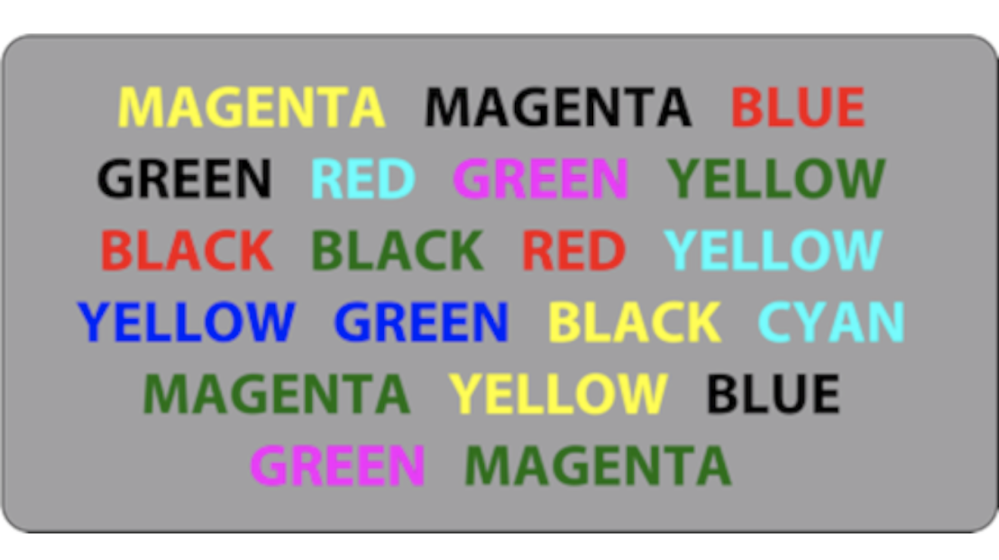

# 命名
<!-- 2020.04.22 -->

> _智慧的开端是对事物合适的命名。_
>
> _-- 孔子_

一个名字里都有什么？当我们在编程时，答案是“一切！”

我们为应用程序、子系统、模块、函数、变量创建名称，我们不断地创建新的东西并赋予它们名称。这些名字非常非常重要，因为它们揭示了你的意图和信仰。

我们相信事物应该根据它们在代码中所扮演的角色来命名。这意味着，无论何时你创造了什么，你都需要停下来思考“我创造这个的动机是什么？”

这是一个很有说服力的问题，因为它能让你从解决问题的思维定势中解脱出来，让你看到全局。当你考虑一个变量或函数的角色时，你在想它有什么特别之处，它能做什么，以及它与什么交互。通常，我们发现自己意识到我们要做的事情毫无意义，都是因为我们找不到合适的名字。

名字很有意义这一观点背后有一些科学依据。事实证明，大脑能够很快地阅读和理解单词：比许多其他活动都要快。这意味着，当
我们试图理解某事时，词语具有一定的优先权。这可以用 Stroop 效应来证明

请看下面的面板。它有一个颜色名称或阴影的列表，每个都以颜色或阴影显示。但是名字和颜色不一定匹配。下面是挑战的第一部分：大声说出每种颜色的名称。



这个面板有两个版本。一种使用不同的颜色，另一种使用灰色阴影。如果你看到的是黑白的并且想要颜色版本，或者你在区分颜色方面有困难并且想要尝试灰度版本，请跳到 https://pragprog.com/the-pragmatic-programmer/stroop-effect

现在重复这个，但是大声说出画出这个词的颜色。更难，是吗？读的时候很容易流利，但要想认颜色就难了。

你的大脑会把书面文字当作是需要检查的东西。我们要确保我们使用的名字符合这一点。

让我们来看看几个例子。

- 我们要验证访问我们的网站的人，该网站是销售用旧显卡制作的珠宝的。

```js
  let user = authenticate(credentials)
```

    这个变量是 user，因为它永远是 user。但是，这真的有什么意义吗？customer，或者 buyer 呢？这样我们在编码的时候就会不断的提醒我们这个人要做什么，以及这个人对我们有什么意义。

- 我们有一个实例方法可以对订单进行折扣。

```java
  public void deductPercent(dual amount)
  // ...
```

    这里有两点。首先，deducturePercent 是做什么的，而不是为什么要做。然后，参数的名称， amount 充其量是个误导：它是一个绝对量，还是一个百分比？

    也许这样会更好。

```java
  public void applyDiscount(Percentential discount)
  // ...
```

    现在方法的名字让它的意图更加清晰了。我们还将参数从 double 改为 Percentential ，这是我们定义的类型。我们不了解你，但在处理百分比时，我们从不知道值应该在 0 到 100 或 0.0 到 1.0 之间。使用类型记录了函数的期望值。

- 我们有一个模块可以用斐波那契数列做一些有趣的事情。其中之一就是计算数列中的数字。停下来想一想，你会怎么称呼这个函数。

    我们问的大多数人都会称它为 fib 。看起来似乎很合理，但请记住它通常会在其模块的上下文中调用，所以调用Fib.fib(n)。不如用 of 或 nth 来代替调用它。

```java
  Fib.of(0) # => 0
  Fib.nth(20) # => 4181
```

在给事物起名时，你会不断地寻找澄清的方法，而这种澄清的行为会让你在写代码的过程中对你的代码有更好的理解。

然而，并不是所有的名字都要成为文学奖的候选人。

---
### 证明规则的例外
虽然我们在代码上力求清晰，但品牌塑造完全是另一回事。

有一个既定的传统，那就是项目和项目团队应该有一个晦涩、"聪明 "的名字。Pokemon、Marvel 人物、可爱的哺乳动物、《权力的游戏》角色的名字，你说了算。

从字面上看，就是这样。

---

## 尊重文化
大多数计算机入门文章都会告诫你千万不要使用单字母变量，如 i、j 或 k。

我们认为他们错了。算是吧。

事实上，这取决于特定的编程语言或环境的文化。在 C 语言中，i、j 和 k 是传统的循环增量变量，s 是用来表示字符串，以此类推。如果你在那个环境下编程，你就会习惯于看到这样的环境，违反这个规范会让人觉得很刺耳（因此也是错误的）。另一方面，在不同的环境中使用该规范也是错误的。你永远不会做像这个 Clojure 的例子一样，把一个字符串分配给变量i，这样的事情是很可怕的。

```clojure
(let [i "Hello World"] (println i))
```

有些语言社区喜欢使用 camelCase，用内嵌式大写字母，而另一些语言社区则喜欢用 snake_case，用内嵌式下划线来分隔单词。语言本身当然也会接受这两种，但这并不意味着它是正确的。尊重当地的文化。

有些语言允许在名称中使用 Unicode 的子集。在使用诸如 "ɹǝsn" 或 "εξρχεται"这样的名字之前，请先了解社区的期望。

## 一致性
爱默生以写过 "愚蠢的一致性是小脑袋里的哈巴狗........... "而闻名于世，但爱默生并不在程序员团队中。

每个项目都有自己的词汇库：对团队有特殊意义的行话词汇。对于一个创建在线商店的团队来说，"秩序" 的含义是一回事，而对于一个负责记录宗教团体血统的团队来说，"秩序" 的含义则大相径庭。团队中的每一个人都要知道这些词的含义，并且坚持使用这些词，这一点很重要。

一种方法是鼓励大家多交流。如果每个人都结对编程，而且结对频繁切换，那么行话就会渗透性地传播。

另一个方法是在上面有一个项目术语表，列出对团队有特殊意义的术语。这是一个非正式的文档，可能是在 wiki 上维护，也可能只是在某个地方的墙上挂着索引卡。

一段时间后，项目术语会有自己的生命力。当大家对这些词汇熟悉了之后，你就可以把这些行话作为一种速记，准确、简洁地表达出很多意思。(这正是模式化的语言 )。

## 重命名更难
无论你在前期投入多少努力，事情都会发生变化。代码会被重构，用法会发生变化，意义也会发生微妙的改变。如果你在更新名称的时候不警惕，你会很快陷入比无意义的名称更糟糕的噩梦：误导性的名称。你是否曾让人解释过代码中不一致的地方，比如说 "名为 getData 的例程真的是把数据写到了归档文件中"？

就像我们在话题 3 [_软件熵_](../Chapter1/软件熵.md) 中讨论的那样，当你发现问题时，就立刻修复它--也就是现在立刻马上 now。当你看到一个不再表达意图的名称，或者是误导性的或令人困惑的名称时，就把它修好。你有完整的回归测试，所以你会发现任何你可能错过的情况。

---
## 提示 74 命名好；必要时再重命名
---

如果由于某种原因，你无法更改现在的错误名称，那么你就有了更大的问题：违反 ETC（见话题 8，[_好设计的本质_](../Chapter2/好设计的本质.md)）。先解决这个问题，然后改掉违规的名字。让重命名变得容易，而且要经常做。

否则你就得向团队里的新成员解释，getData 真的是把数据写到文件里，并且您必须直面这一点。

## 相关内容包括
- 话题 3  [_软件熵_](../Chapter1/软件熵.md)
- 话题 40 [_重构_](./重构.md)
- 话题 45 [_需求坑_](../Chapter8/需求坑.md)

## 挑战
- 当你发现一个函数或方法的名字过于通用时，试着重命名，以表达它真正的作用。现在，它是一个更容易被重构的目标。

- 在我们的例子中，我们建议使用更具体的名称，如 buyer 等，而不是更传统和通用的 user。对于你来说，还有什么其他的名字可以更好的习惯性使用？

- 你的系统中的名称是否与域中的用户术语一致？如果不一致，原因是什么？这是否会导致团队的认知失调，造成斯特罗普效应式的认知失调？

- 你的系统中的名称是否难以更改？你能做什么来修复那个特定的破窗？
